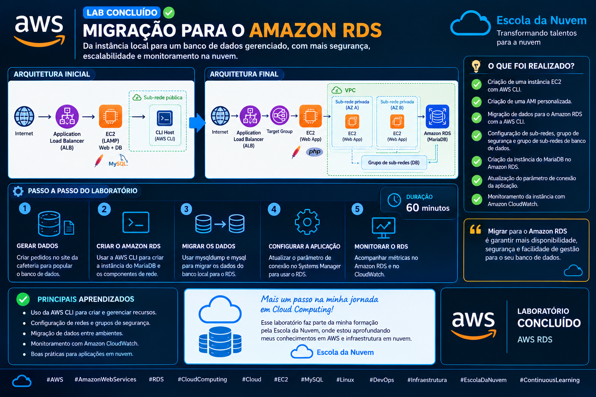
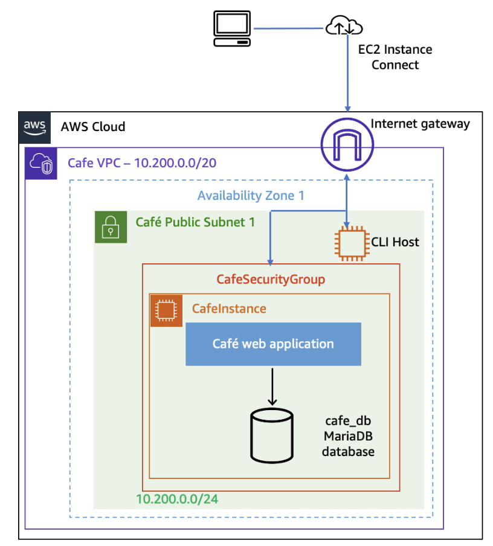
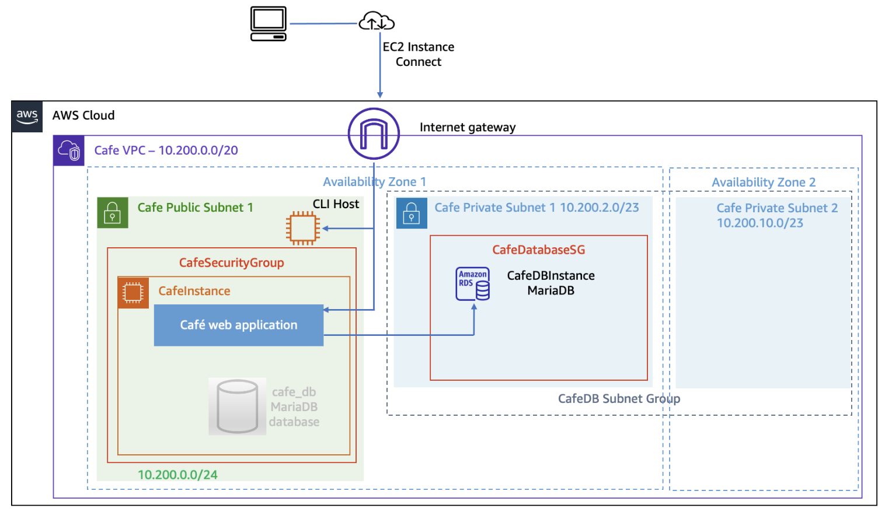
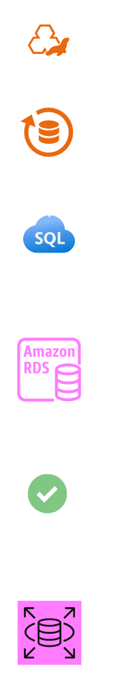
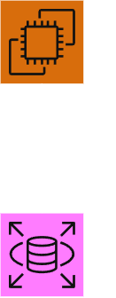
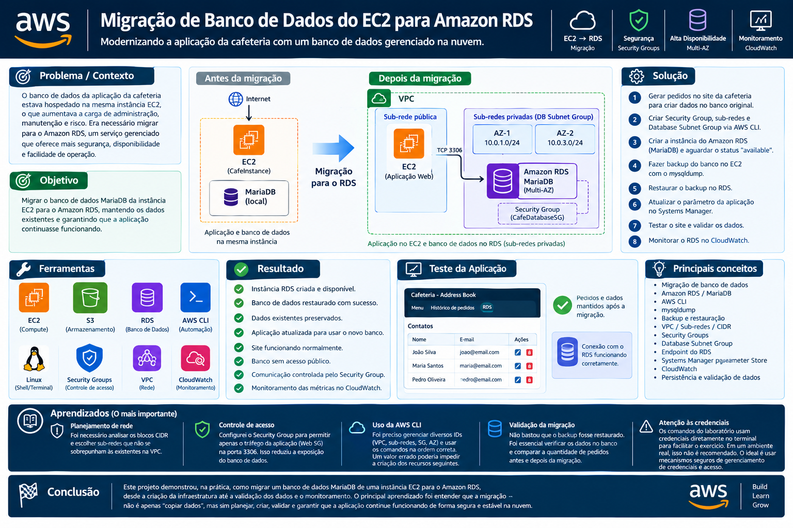

# Migração de Banco de Dados do EC2 para Amazon RDS

A aplicação da cafeteria utilizava inicialmente um banco de dados **MariaDB hospedado diretamente em uma instância Amazon EC2**.

Embora seja possível executar um banco de dados dessa forma, isso significa que a administração do banco, armazenamento, backups, manutenção e monitoramento ficam sob responsabilidade da infraestrutura da instância.

O objetivo deste laboratório foi simular um cenário de migração de um banco de dados autogerenciado para o **Amazon RDS**, utilizando um serviço gerenciado para reduzir a necessidade de administração direta da infraestrutura do banco.

Além da migração dos dados, foi necessário garantir que a aplicação continuasse funcionando e que os pedidos existentes permanecessem disponíveis após a mudança.

## Objetivo

O objetivo foi realizar a migração do banco de dados MariaDB utilizado pela aplicação da cafeteria de uma instância **Amazon EC2** para uma nova instância **Amazon RDS**.

Durante o projeto, os principais objetivos foram:

- Criar uma instância MariaDB no Amazon RDS utilizando a AWS CLI;
- Criar um Security Group específico para o banco de dados;
- Criar sub-redes privadas para o RDS;
- Criar um Database Subnet Group;
- Configurar o RDS sem acesso público;
- Criar um backup do banco de dados existente utilizando `mysqldump`;
- Restaurar o backup na nova instância RDS;
- Validar a integridade dos dados após a migração;
- Configurar a aplicação para utilizar o novo banco;
- Monitorar o banco de dados utilizando métricas do **Amazon CloudWatch**.

## Solução

Foi construída uma solução na qual o banco de dados originalmente executado no EC2 foi migrado para uma instância **Amazon RDS for MariaDB**.

### Arquitetura antes da migração

Nesse cenário, a aplicação e o banco de dados estavam associados à mesma infraestrutura EC2.

### Arquitetura depois da migração

A aplicação passou a utilizar o RDS como banco de dados, enquanto o EC2 ficou responsável pela camada de aplicação.

### 1. Preparação do ambiente

Antes da migração, foram realizados pedidos no site da cafeteria para gerar dados reais na aplicação.

Esses pedidos serviram como referência para validar posteriormente se os dados haviam sido migrados corretamente.

A quantidade de pedidos registrada antes da migração foi utilizada para comparação após a restauração do banco no RDS.

### 2. Criação da infraestrutura utilizando AWS CLI

A infraestrutura do novo banco foi criada utilizando a **AWS CLI** a partir de uma instância EC2 preparada para executar os comandos.

A CLI foi configurada com a região e as credenciais fornecidas pelo ambiente de laboratório.

Foram criados:

- `CafeDatabaseSG`;
- Sub-rede privada `CafeDB`;
- Segunda sub-rede privada `CafeDB`;
- `CafeDB Subnet Group`.

### 3. Configuração do Security Group

Foi criado o:

`CafeDatabaseSG`

A regra de entrada foi configurada para permitir somente:

**Protocolo:** TCP 
**Porta:** `3306` 
**Origem:** `CafeSecurityGroup`

Isso significa que o banco não foi exposto para qualquer origem.

A comunicação foi limitada às instâncias associadas ao **CafeSecurityGroup**, permitindo que a aplicação da cafeteria se comunicasse com o banco utilizando o protocolo MySQL.

### 4. Criação das sub-redes privadas

Foram criadas duas sub-redes privadas dentro da VPC da cafeteria:

`CafeDB Subnet 1`
**CIDR:** 10.200.2.0/23

`CafeDB Subnet 2`
**CIDR:** 10.200.10.0/23

Foi necessário analisar os blocos CIDR existentes na VPC para evitar sobreposição de endereços.

As duas sub-redes foram utilizadas para formar o:

`CafeDB Subnet Group`

Esse grupo foi associado posteriormente à instância RDS.

### 5. Criação da instância Amazon RDS

Após preparar a infraestrutura, foi criada a instância:

`CafeDBInstance`

Configurações principais:

- **Engine:** MariaDB;
- **Versão:** 10.5.13;
- **Classe:** `db.t3.micro`;
- **Armazenamento:** 20 GB;
- **Acesso público:** desabilitado;
- **VPC:** VPC da cafeteria;
- **DB Subnet Group:** `CafeDB Subnet Group`;
- **Security Group:** `CafeDatabaseSG`.

Após a criação, foi necessário aguardar até que o status da instância mudasse para:

`available`

O **Endpoint** fornecido pelo RDS foi registrado para ser utilizado durante a migração.

### 6. Backup do banco de dados original

Com a nova infraestrutura pronta, foi realizado o backup do banco **MariaDB** que estava hospedado na instância EC2.

Foi utilizado o comando:

`mysqldump --user=root --password='Re:Start!9'\`  
`--databases cafe_db --add-drop-database > cafedb-backup.sql`

O comando gerou o arquivo:

`cafedb-backup.sql`

Esse arquivo continha as instruções SQL necessárias para recriar o banco, incluindo estrutura, tabelas, índices e dados.

### 7. Restauração no Amazon RDS

Após gerar o backup, o arquivo foi restaurado diretamente na nova instância **MariaDB** do RDS.

A conexão foi realizada utilizando o **Endpoint do RDS**:

`mysql --user=root --password='Re:Start!9'\`  
`--host=<RDS Endpoint>\`  
`< cafedb-backup.sql`

Dessa forma, as estruturas e os dados do banco original foram reproduzidos na nova instância gerenciada pelo Amazon RDS.

### 8. Validação dos dados

Após a restauração, foi realizada uma conexão com o banco `cafe_db` no RDS.

A tabela de produtos foi consultada utilizando:

`SELECT * FROM product`;

Os dados encontrados foram comparados com os dados existentes antes da migração.

Também foi comparada a quantidade de pedidos registrada no início do laboratório com a quantidade disponível após a migração.

O resultado confirmou que os dados haviam sido transferidos corretamente.

### 9. Configuração da aplicação

Depois da migração, a aplicação ainda precisava saber onde encontrar o novo banco de dados.

Para isso, foi utilizado o **AWS Systems Manager Parameter Store**.

O parâmetro:

`/cafe/dbUrl`

foi atualizado para utilizar o Endpoint da nova instância RDS.

Essa abordagem permitiu alterar a localização do banco sem precisar modificar diretamente o código da aplicação.

### 10. Teste da aplicação

Após atualizar o parâmetro, o site da cafeteria foi acessado novamente.

Foi verificado:

- Carregamento da aplicação;
- Histórico de pedidos;
- Dados existentes antes da migração;
- Persistência das informações;
- Funcionamento da aplicação utilizando o RDS.

Os pedidos existentes permaneceram disponíveis após a mudança do banco de dados.

Também foi possível realizar novos pedidos para validar o funcionamento da aplicação após a migração.

### 11. Monitoramento do Amazon RDS

Após concluir a migração, foram analisadas as métricas de monitoramento disponíveis no RDS por meio do **Amazon CloudWatch**.

Foram observadas métricas como:

- `CPUUtilization`;
- `DatabaseConnections`;
- `FreeStorageSpace`;
- `FreeableMemory`;
- `WriteIOPS`;
- `ReadIOPS`.

Também foi realizado um teste utilizando a métrica:

`DatabaseConnections`

Uma conexão SQL foi aberta a partir da instância EC2 e foi possível observar a quantidade de conexões ativas no monitoramento do RDS.

Após encerrar a sessão SQL, a métrica foi atualizada e demonstrou a redução da quantidade de conexões.

## Ferramentas

- **Amazon EC2** — hospedagem da aplicação e do banco de dados original;
- **Amazon RDS** — novo ambiente gerenciado para o MariaDB;
- **MariaDB** — mecanismo do banco de dados;
- **AWS CLI** — criação e gerenciamento dos recursos AWS;
- **Amazon VPC** — infraestrutura de rede;
- **Security Groups** — controle de comunicação entre EC2 e RDS;
- **Subnets** — criação da estrutura de rede privada;
- **Database Subnet Group** — definição das sub-redes utilizadas pelo RDS;
- **AWS Systems Manager Parameter Store** — armazenamento do endpoint utilizado pela aplicação;
- **Amazon CloudWatch** — monitoramento das métricas do RDS;
- **Linux** — execução dos comandos de backup e restauração;
- **mysqldump** — geração do backup do banco;
- **MySQL/MariaDB CLI** — conexão e validação dos dados.

## Resultado

A migração foi concluída com sucesso.

O banco de dados MariaDB que originalmente estava hospedado no EC2 foi migrado para uma instância **Amazon RDS**.

Ao final do processo:

- O RDS foi criado e ficou disponível;
- O banco `cafe_db` foi restaurado;
- Os dados existentes foram preservados;
- Os pedidos realizados antes da migração continuaram disponíveis;
- A aplicação foi configurada para utilizar o novo banco;
- Novos pedidos puderam ser realizados;
- O banco ficou sem acesso público;
- A comunicação EC2 → RDS foi controlada pelo Security Group;
- O RDS pôde ser monitorado através das métricas do **CloudWatch**.

A arquitetura passou de um banco autogerenciado no EC2 para uma solução utilizando um **serviço de banco de dados gerenciado pela AWS**.

## Aprendizados — O mais importante

O principal aprendizado deste projeto foi entender na prática o processo de **migração de um banco de dados autogerenciado para um serviço gerenciado de nuvem**.

Mais do que simplesmente criar um RDS, foi necessário pensar no processo completo:

### Planejamento de rede

Um dos pontos que exigiu mais atenção foi o planejamento dos blocos CIDR das novas sub-redes.

Foi necessário verificar os endereços já utilizados pela VPC e escolher intervalos que não entrassem em conflito.

Isso reforçou a importância de compreender **endereçamento IP, CIDR, VPC e sub-redes** antes de criar recursos de rede na AWS.

### Segurança da comunicação

Outro aprendizado importante foi configurar o banco sem acesso público:

O acesso foi controlado através do Security Group, utilizando o grupo de segurança da aplicação como origem da regra.

Isso é mais adequado do que simplesmente liberar a porta `3306` para qualquer endereço.

### Uso da AWS CLI

Diferentemente de projetos realizados somente pelo Console da AWS, neste laboratório grande parte da infraestrutura foi criada utilizando comandos da **AWS CLI**.

Isso exigiu atenção principalmente na utilização dos IDs retornados pelos comandos anteriores, como:

- VPC ID;
- Security Group ID;
- Subnet ID;
- Availability Zone;
- RDS Endpoint.

Um valor incorreto em uma etapa poderia impedir a criação ou configuração correta do recurso seguinte.

### Validação da migração

Um dos pontos mais importantes foi não considerar a migração concluída apenas porque o comando de restauração terminou.

Foi necessário verificar os dados diretamente no banco e comparar os pedidos existentes antes e depois da migração.

Isso mostrou a importância de sempre realizar validação **pós-migração**, garantindo que os dados realmente foram transferidos e que a aplicação continua funcionando.

### Monitoramento

Depois de migrar o banco, também foi possível perceber que uma solução Cloud não termina na criação do recurso.

O monitoramento através do **CloudWatch** permite acompanhar informações como utilização de CPU, conexões, memória, armazenamento e operações de I/O.

Isso é fundamental para identificar problemas de desempenho e acompanhar a saúde do banco.

### Observação sobre credenciais

Os comandos do laboratório utilizam credenciais diretamente na linha de comando para facilitar o exercício.

Essa abordagem foi utilizada **somente no ambiente controlado do laboratório**.

Em um ambiente de produção, credenciais e senhas não devem ser expostas dessa maneira. O ideal é utilizar mecanismos apropriados de gerenciamento de credenciais, identidades e acesso, evitando armazenar segredos diretamente em comandos, scripts ou código.

## Principais conceitos aprendidos

- Migração de banco de dados;
- Amazon RDS;
- MariaDB;
- Amazon EC2;
- AWS CLI;
- `mysqldump`;
- Backup e restauração;
- Amazon VPC;
- CIDR;
- Sub-redes privadas;
- Database Subnet Group;
- Security Groups;
- Endpoint do RDS;
- AWS Systems Manager Parameter Store;
- Amazon CloudWatch;
- Monitoramento de banco de dados;
- Persistência de dados;
- Validação pós-migração;
- Segurança de acesso ao banco;
- Serviços gerenciados na AWS.

## Conclusão

Este projeto demonstrou na prática um processo completo de **migração de um banco de dados MariaDB hospedado em uma instância EC2 para o Amazon RDS**.

O laboratório permitiu trabalhar desde a preparação da infraestrutura e configuração de rede até o backup, restauração, validação dos dados, atualização da aplicação e monitoramento.

O principal aprendizado foi entender que uma migração de banco não consiste apenas em copiar dados. É necessário planejar a infraestrutura, controlar o acesso, preservar os dados, validar o resultado e garantir que a aplicação continue funcionando após a mudança.

Esse processo representa uma situação bastante próxima de um cenário real de **Cloud/Infraestrutura**, em que serviços autogerenciados podem ser migrados para serviços gerenciados para facilitar operações, manutenção e monitoramento.
